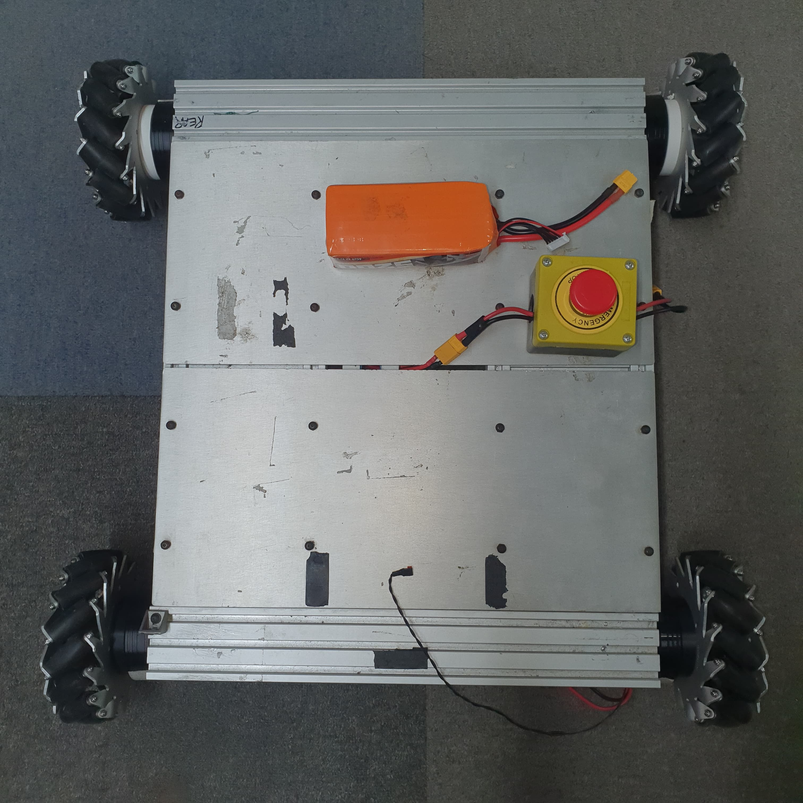
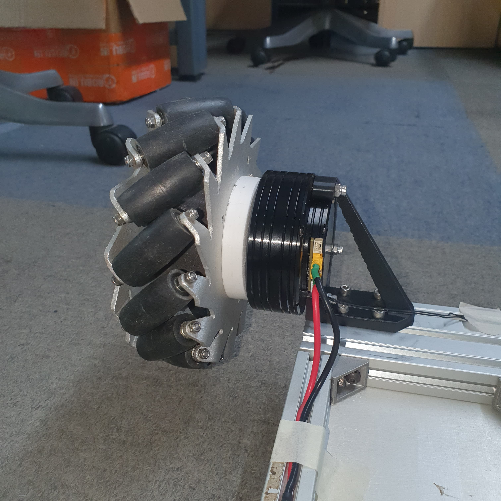
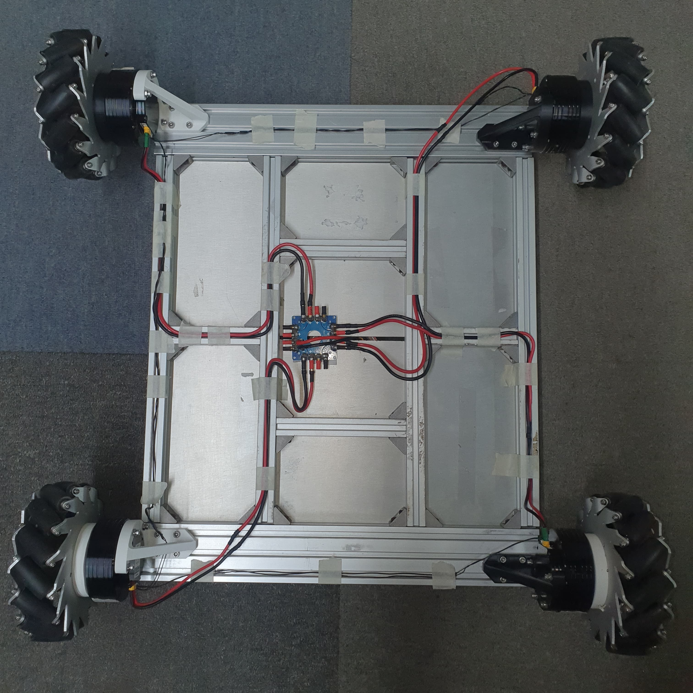

# Hardware Setup

This document outlines the hardware components and specifications for the mecanum drive robot used in the MPC Holonomic Navigation project.

## Mecanum Drive Specifications

### Drive System
- **Configuration**: 4-wheel mecanum drive (omni-directional)
- **Wheel Diameter**: 152mm mecanum wheels
- **Material**: Aluminum chassis with 3D printed motor mounts
- **Dimensions**: 520mm × 480mm × 152mm (L×W×H)

### Actuators
- **Motors**: 4× AK60 brushless actuators
- **Controller**: Integrated motor controllers
- **Encoders**: Built-in high-resolution encoders (4096 CPR)
- **Communication**: CAN bus interface (1Mbps)
- **Power**: 24V DC power supply
- **Torque Rating**: 3 N·m continuous, 22.7 N·m peak

## Assembly Design

The motor mounts are 3D printed using PLA material with 50% infill for durability. CAD models for the mounts are available in the [/docs/stl](/docs/stl/) directory.

## Wiring Diagram

## Control Architecture

The AK60 actuators connect to the Intel NUC through a CAN bus interface,~~we use a modified version of the [WiCAN Hardware](https://github.com/mittechteam/wican-fw)~~ we use the [USB2CAN Module](https://docs.odriverobotics.com/v/latest/hardware/usb-can-datasheet.html) from ODrive. The system uses ROS2 nodes to:
1. Read encoder data from motors
2. Calculate odometry
3. Send velocity commands to individual wheels